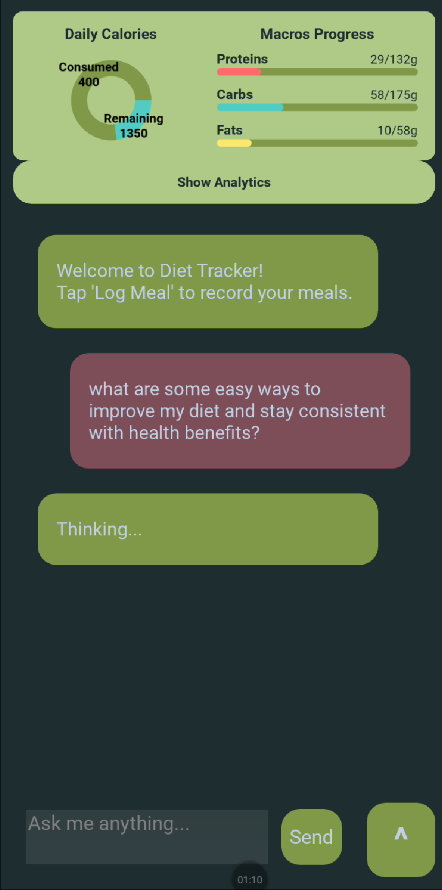
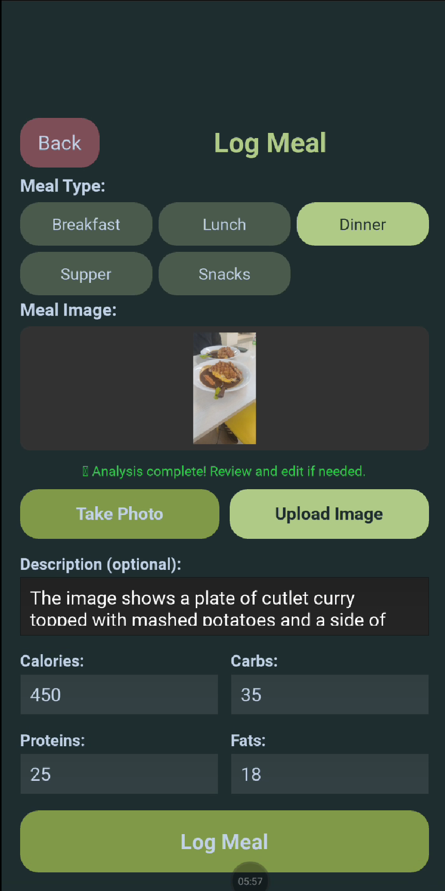
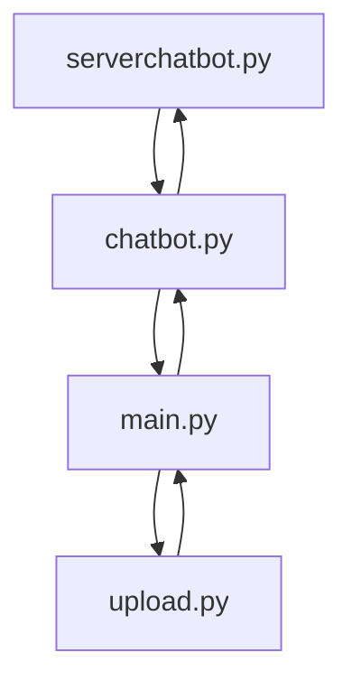

# AllHealthy Diet Tracking Mobile App Project
## By: Chua Wen Hung Gary @ NYP

# Project Overview:

<p align="center">
  
  
</p>

AllHealthy is a mobile nutrition tracking app that integrates a multimodal LLM for food image analysis, calorie and macronutrient estimation, and automated logging to a Firebase database. The app is built using Kivy, Google Firebase and ngrok, compiled for Android with Buildozer. The app is only tested with android mobile device, IOS app is possible with buildozer but requires modification.


## Features:
### 1. Core
- Nutrition tracking using multimodal LLM
- Food image analysis and calorie/macronutrient estimation
- Meal type selection (Breakfast, Lunch, Dinner, Supper, Snacks)
- Manual editing of nutrient values
- Support for meal descriptions
- After-meal energy and hunger level survey
- Meal logging to Firebase
- After-meal tips based on thresholds
- Chat with LLM nutrition and fitness coach
- New: Recipe generation with image and text prompt
- New: User daily macro goals editing

### 2. AI/Model 
- Image recognition for food type and portion
- Calorie, protein, carbs, and fats estimation
- Autocomplete nutrient fields after image analysis
- General chatbot conversation
- Macro-aware responses (uses user data)
- Model inference via remote computer GPU (Flask + ngrok server)
- Supports multiple model versions with minimal code tweaks
  - Qwen2 VL 2B Instruct (initial)
  - Qwen2.5 VL 7B Instruct (**recommended final**, works best for 16GB GPU VRAM without going out of memory)
  - Qwen3 VL 8B Instruct (final)

### 3. UI/UX
- Built with Kivy
- AI-generated logo
- Natural green color theme
- Mobile-style UI running on desktop & Android
- Chat interface with chat bubbles
- Input box stays above virtual keyboard for visibility
- Image selection and preview
- Nutrients input form (manual and AI response fields)
- Macros header graphs/data visualization (Kivy graphics)

### 4. Database (Firebase)
- Firestore database storage for:
  - User profile
  - Diet restrictions (room for future implementation)
  - Religious limitations (room for future implementation)
  - Meal logs
  - Macro totals
- Read and write via Firebase REST API
- Daily meal entries by category (breakfast, lunch, dinner, supper, snacks)
- Support for editing and overwriting values
- Data retrieval for future visualizations

### 5. Build & Deployment
- Android APK built using Buildozer
- Python-for-Android Git recipe
- Supports WSL2 for building
- GPU inference handled remotely (zero on-device AI load)
- Debug and release build setup
- Support for Docker deployment

# Table of Contents:
- Quick Start
- Prerequisites
- Folder Structure Overview
- App Architecture
- How It Works
- Google Firebase Configuration
- Instructions for Using Your Own Resources
- Instructions for Server Set Up
- Instructions for Compiling Android App
- App Usage
- Nutrition Thresholds
- License

# Quick Start:
Note: LLM features require the serverchatbot docker container or .py file to be running.

1. Replacing/Using your own resources:
```
# main.py:
USER_ID = "#USER_ID#"
PROJECT_ID = "#PROJECT_ID#"
FIREBASE_URL = f"https://firestore.googleapis.com/v1/projects/{PROJECT_ID}/databases/(default)/documents"

# chatbot.py:
NGROK_URL = "#NGROK_DOMAIN_URL#"

# serverchatbot.py:
ngrok.set_auth_token('#YOUR_NGROK_AUTH_TOKEN HERE#')

# upload.py:
API_KEY = "#FIREBASE_API_KEY#" 
PROJECT_ID = "#PROJECT_ID#"
BASE_URL = f"https://firestore.googleapis.com/v1/projects/{PROJECT_ID}/databases/(default)/documents"
```
2. Running Server Chatbot:
- Open or leave docker desktop running
- Use a terminal that can run a run.sh docker container to run the commands:
```
cd <path/folder of serverchatbot.py>
bash run.sh
```
- Close server with the following input:
```
ctrl + c
```
3. Compiling Android APK:
```
# Run following pip install commands using Linux or one of it's distros:
sudo apt update

sudo apt install -y \
    python3 python3-pip python3-setuptools python3-dev \
    build-essential \
    git \
    zip unzip \
    openjdk-17-jdk \
    libncurses5 libncurses5-dev \
    zlib1g zlib1g-dev \
    libstdc++6 \
    autoconf automake libtool \
    pkg-config \
    cmake \
    libffi-dev \
    libssl-dev \
    cython3 \
    libjpeg-dev libpng-dev \
    libsqlite3-dev

# For WSL:
sudo apt install libglu1-mesa

# Create a python environment in project folder:
python3 -m venv venv
source venv/bin/activate

# Install buildozer:
pip install "Cython<3"
pip install buildozer
pip install python-for-android
pip install git+https://github.com/kivy/python-for-android

# Compile APK Commands:
buildozer android debug (test build, fastest)
buildozer android release (full build, slowest)
buildozer android clean (clean previous builds to remove errors)
```

# Prerequisites:
1. Python Version: 3.10.x
2. Hardware Requirements: GPU with suitable architecture for torch CUDA operations.
3. Firebase Account: Free project + Cloud Firestore **Configuration can be found below**
4. ngrok account: Free public domain + auth token

# Folder Structure Overview:
```bash
AllHealthy
├───assets
│   └───style.kv                                {styling for app UI}
├───bin
│   └───allhealthy.apk                          {compiled apk for android}
├───serverchatbot
│   ├───docker-compose.yml                      {docker compose file}
│   ├───Dockerfile                              {docker config file}
│   ├───requirements.txt                        {library installation dependencies}
│   ├───model_download.py                       {local download code for model}
│   └───serverchatbot.py                        {ngrok + flask server llm code}
├───AllHealthyLogo.png                          {app Logo}
├───buildozer.spec                              {app compilation dependencies and configuration}
├───chatbot.py                                  {chatbot logic code}
├───upload.py                                   {firebase cloud firestore data upload code}
├───main.py                                     {UI and app logic code}
├───README.md                                   {project information /THIS FILE/}
└───run.sh                                      {file for running docker container}
```

# App Architecture:
App flowchart expects .md file to render the diagram:

# How it works:
## The Four Main Components
### 1. **main.py** - The User Interface
This is what you see and interact with on your phone or computer. It contains:

- **Screens you navigate through:**
  - Loading screen when the app starts
  - Main chat screen where you talk to the nutrition assistant
  - Meal logging screen where you upload food photos
  - Macro goals screen where you set your daily targets
  - Recipe generator screen where you create recipes from ingredients

- **Visual displays:**
  - Pie charts showing calories consumed vs. remaining
  - Progress bars for protein, carbs, and fats
  - Line graphs displaying 7-day nutrition trends
  - Chat bubbles for conversations with the AI assistant

- **Input methods:**
  - Camera to take photos of meals
  - Image gallery to upload existing photos
  - Text fields to enter nutrition values or chat messages
  - Buttons to select meal types (breakfast, lunch, dinner, etc.)

**How it connects:** main.py sends your food photos to chatbot.py for analysis and sends your meal data to upload.py to save in the cloud.

### 2. **upload.py** - The Cloud Storage Manager
This handles saving and retrieving your data from Firebase (cloud storage). It:

- **Saves your information:**
  - Logs each meal with its nutrition values (calories, protein, carbs, fats)
  - Records energy and hunger levels after meals
  - Stores your daily macro goals
  - Timestamps everything so you can track by date

- **Retrieves your information:**
  - Fetches today's meals to show current progress
  - Gets your macro goals to calculate remaining targets
  - Pulls 7 days of data for analytics graphs

**How it connects:** main.py calls upload.py whenever you log a meal or update goals. upload.py talks directly to Firebase's online database to store/retrieve data.

### 3. **chatbot.py** - The Communication Bridge
This is the messenger between your phone and the multimodal LLM. It:

- **Prepares your requests:**
  - Compresses food photos to smaller sizes for faster sending
  - Converts images to a format the AI can understand (base64 encoding)
  - Packages your chat messages with relevant context (today's macros, goals, meals logged)

- **Sends requests to the AI:**
  - Food photo > "What nutrition is in this meal?"
  - Meal data > "Give me tips based on what I ate"
  - Chat message > "Answer this nutrition question"
  - Text/photo > "Generate a recipe from these ingredients"

- **Returns AI responses:**
  - Nutrition estimates (calories, protein, carbs, fats)
  - Food descriptions (what's in the photo)
  - Personalized advice (tips for your next meal)
  - Recipe instructions

**How it connects:** main.py calls chatbot.py functions when you take a photo or send a chat. chatbot.py sends these to serverchatbot.py (the AI computer) and brings back the answers.

### 4. **serverchatbot.py** - The Remote Multimodal LLM
This runs on a powerful computer with the LLM loaded in memory. It:

- **Analyzes food photos:**
  - Recognizes ingredients and dishes in images
  - Estimates portion sizes
  - Calculates nutritional breakdown

- **Generates personalized advice:**
  - Compares your meal to recommended limits
  - Detects if you exceeded protein, carbs, or fat targets
  - Notices if you're still hungry or low on energy
  - Creates specific tips for your next meal

- **Answers nutrition questions:**
  - Uses your current progress (macros consumed vs. goals)
  - Knows which meals you've logged today
  - Provides relevant, context-aware responses

- **Creates recipes:**
  - Identifies ingredients in photos
  - Generates step-by-step cooking instructions
  - Includes measurements and cooking times

**How it connects:** serverchatbot.py receives requests from chatbot.py through the internet (via ngrok), processes them using the AI model, and sends back results.

## Examples:

### When you log a meal:
1. **You** take a photo in main.py
2. **main.py** sends the photo to chatbot.py
3. **chatbot.py** compresses it and forwards to serverchatbot.py
4. **serverchatbot.py** analyzes the image with AI and estimates nutrition
5. **chatbot.py** receives the nutrition data and sends it back
6. **main.py** displays the results and lets you confirm/edit
7. **You** rate your energy and hunger levels
8. **main.py** calls upload.py to save everything
9. **upload.py** stores the meal in Firebase cloud
10. **serverchatbot.py** checks if you exceeded any thresholds
11. **main.py** displays personalized tips from the AI

### When you chat with the assistant:
1. **You** type a question in main.py
2. **main.py** sends it to chatbot.py with context (your macros, goals, meals logged)
3. **chatbot.py** forwards everything to serverchatbot.py
4. **serverchatbot.py** generates a contextual response using AI
5. **chatbot.py** receives the answer
6. **main.py** displays it in the chat

# Firebase Configuration
This diagram shows data type and example values. Fields marked with # are not being currently used and are meant for future implementation.
```bash
(default)
users
├───(user1)
│   ├───name                    {string: Elmo, Frank} #
│   ├───age                     {number: 20, 21} #
│   ├───gender                  {string: 'male', 'female'} #
│   ├───religion                {string: 'Christian', 'Buddhist'} #
│   ├───diet_restrictions       {string: 'Lactose intolerant', 'Shellfish allergy'} #
│   ├───daily_macros_goals        {map}
│   │   ├───calories                {number: 1750, 2050}
│   │   ├───carbs                   {number: 150, 170}
│   │   ├───fats                    {number: 30, 50}
│   │   └───proteins                {number: 78, 84}
│   └───meallogs                  {collection}
│       ├───(previousdate)      
│       └───(currentdate)           {document: string: YYYY-MM-DD, 2025-11-29}
│           ├───Breakfast       
│           │   └───...
│           ├───Lunch
│           │   └───...
│           ├───Dinner
│           │   └───...
│           ├───Supper
│           │   └───...
│           ├───Snacks              {map}
│           │   ├───calories          {number: 100, 200}
│           │   ├───carbs             {number: 20, 30}
│           │   ├───fats              {number: 5, 10}
│           │   ├───proteins          {number: 7, 12}
│           │   ├───energy            {number: 2, 4}
│           │   └───hunger            {number: 3, 5}
│           └───last_updated        {timestamp: 29 November 2025 at 10:30:00 UTC+8}
├───(user2)
│   └───...
├───(userx)
│   └───...
├───...
```
# Instructions for Using Your Own Resources:
This app uses Google Firebase and ngrok which will require you to use your own keys/apis/urls. The following list details where you need to change/replace them.

1. main.py:
```
...

USER_ID = "#USER_ID#"
PROJECT_ID = "#PROJECT_ID#"
FIREBASE_URL = f"https://firestore.googleapis.com/v1/projects/{PROJECT_ID}/databases/(default)/documents"

...
```

2. chatbot.py:
```
...

NGROK_URL = "#NGROK_DOMAIN_URL#"

...
```

3. upload.py
```
...

API_KEY = "#FIREBASE_API_KEY#" 
PROJECT_ID = "#PROJECT_ID#"
BASE_URL = f"https://firestore.googleapis.com/v1/projects/{PROJECT_ID}/databases/(default)/documents"

...
```

4. serverchatbot.py
```
...

ngrok.set_auth_token('#YOUR_NGROK_AUTH_TOKEN HERE#')

...
```

# Instructions to Set Up Server for Multimodal LLM:

You will need your own ngrok account and auth token to run server. However, you can use your own registered DNS and or other paid services to run the server with appropriate modifications to the code.

## 1. Automatic Set Up (Docker Desktop):
### Steps:
1. Ensure you have docker desktop
2. Open or leave docker desktop running
3. Use a terminal that can run a run.sh docker container to run the commands:(Tested and functional with Ubuntu)
```
cd <path of serverchatbot.py>
bash run.sh
```
4. Close server with the following input:
```
ctrl + c
```
### How it works:
The **run.sh** file will run the **Dockerfile** which will install dependencies and copy files into the docker container. The **Dockerfile** will then run **entrypoint.sh** to check if the model **serverchatbot.py** uses exists. If it does not exist, it will use **model_download** to download the model from huggingface. If it exists, it will skip and run **serverchatbot.py**, starting the server.

## 2. Manual Set Up:
### Steps:
1. Install/Use python 3.10.x
2. Run following pip install commands:
```
# For PyTorch with CUDA:
pip install torch==2.5.1 torchvision==0.20.1 torchaudio==2.5.1 --extra-index-url https://download.pytorch.org/whl/cu121

# For the LLM model (latest transformers and accelerate)
pip install git+https://github.com/huggingface/transformers
pip install accelerate

# or:

pip install --upgrade accelerate

# The rest of the package dependencies:
pip install -r requirements.txt
```
3. Run the model_download.py to install the model locally.
```
...

snapshot_download(
    repo_id = model_id,
    local_dir=r"C:\models\Qwen3-VL-8B-Instruct"  # Use any suitable path
    local_dir_use_symlinks=False
)
```
4. Run the serverchatbot.py to start the server with the model running remotely.
```
# Use previously set model path
model_path = r"#model path here#"
...
```

## Common Issues:
1. CUDA not available: You need torch with cuda functionality to run the model. Running the first command should install torch with cuda.
2. Issues with loading or after loading model: Load the model first without quantization then try again with quantization.

# Instructions for Compiling the APK for mobile devices (ANDROID)
You will need multiple dependencies to ensure that the app compiler, buildozer can run without issues. There is a provided buildozer.spec with app compilation specifications but they can be modified to fit different devices such as ios at your own discretion.

1. Run following pip install commands (WSL or Linux Distro):
```
sudo apt update

sudo apt install -y \
    python3 python3-pip python3-setuptools python3-dev \
    build-essential \
    git \
    zip unzip \
    openjdk-17-jdk \
    libncurses5 libncurses5-dev \
    zlib1g zlib1g-dev \
    libstdc++6 \
    autoconf automake libtool \
    pkg-config \
    cmake \
    libffi-dev \
    libssl-dev \
    cython3 \
    libjpeg-dev libpng-dev \
    libsqlite3-dev
```
For WSL:
```
sudo apt install libglu1-mesa
```

2. Create a python environment in project folder:
```
python3 -m venv venv
source venv/bin/activate
```

3. Install buildozer: 
```
pip install "Cython<3"
pip install buildozer
pip install python-for-android
pip install git+https://github.com/kivy/python-for-android
```
Cython has a bug for versions above 3.0. Use versions before 3.0.

3. Create buildozer.spec for app compilation (Skip to step 5 if buildozer.spec already exists):
If you haven't created a buildozer.spec file, run:
```
buildozer init
```

4. Modify/Add the following inside buildozer.spec (**EXCLUDE DASHES**):
- title = AllHealthy
- package.name = allhealthy
- package.domain = org.allhealthy
- source.dir = .
- source.main = main.py
- version = 0.1
- requirements = python3,kivy,plyer,requests,pillow
- icon.filename = assets/AllHealthyLogo.png
- orientation = portrait

- source.include_exts = py,png,jpg,jpeg,ttf,kv,atlas
- android.permissions = INTERNET,READ_EXTERNAL_STORAGE,WRITE_EXTERNAL_STORAGE,CAMERA

- android.gradle_dependencies = androidx.core:core:1.6.0
- android.enable_androidx = True
- android.archs = arm64-v8a, armeabi-v7a
- android.manifest.activity = android:windowSoftInputMode="adjustResize"

5. Run the following buildozer commands:
For debug release (faster compile time than official with less):
```
buildozer android debug
```

For official release (longer compile time than debug with):
```
buildozer android release
```

For cleaning old build (use when there are errors in compiling or change in required imports within buildozer).
```
buildozer android clean
```

Building for the first time or after a clean will take a long time: 1-2 hours to install with the bulk being dependencies.

# App usage:
1. Instead of a black screen, the user is greeted with a nice loading screen when the app is open. It checks if the model is running with a health check through flask and renders the app UI. 
2. Once the app is rendered, the user will reach a chat interface screen where they can:
- Check on their current calorie and macro intake
- Ask general questions to the LLM
- Go to the log meal page with a button on the bottom right
3. The log meal page allows users to log the nutrients of their meals for each meal type: (breakfast, lunch, dinner, supper, snacks). They can log their meals via two methods:
- Nutrient estimation with the LLM or
- Manual estimation/calculation before filling a form
Logging the meal will open a survey to get the user's energy and hunger levels after the meal.
4. The user will then be brought back to the chat interface screen where the meal information will be returned in a chat bubble. If the meal exceeds certain thresholds that may impact/interfere with their daily intake goals, the LLM will generate tips to help the user adjust their next meals to counteract excessive intake from their previous meal. **Thresholds can be found below**
5. On the chat interface screen, users can expand the calorie and macro intake header to see more data on their progress for the past 7 days.

## Thresholds That Trigger Tips Generation:
The serverchatbot.py uses percentages of the user's daily calorie goals to determine whether the meal they have just logged may interfere with meeting their goal.

Meal Type | Calories %
--- | ---
Breakfast | 20%
Lunch | 31%
Dinner | 29%
Snack | 9%
Supper | 11%

For the macros, a general percentage is applied to all at 40% of the daily macro goals correspondingly for proteins, fats and carbs.