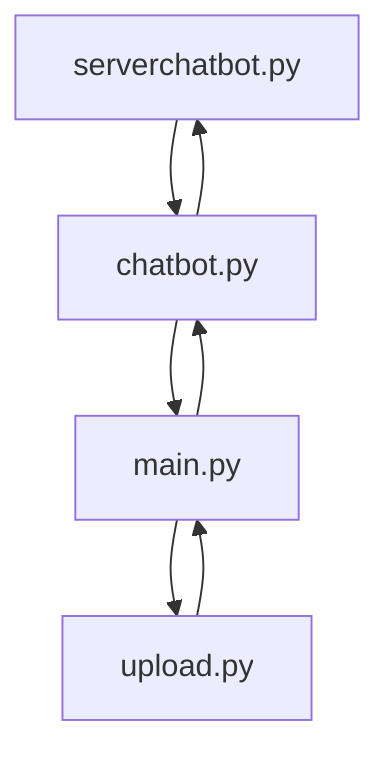

# AllHealthy Diet Tracking Mobile App Project
## By: Chua Wen Hung Gary @ NYP

# Project Overview:

AllHealthy is a mobile nutrition tracking app that integrates a multimodal LLM for food image analysis, calorie and macronutrient estimation, and automated logging to a Firebase database. The app is built using Kivy and Google Firebase, compiled for Android with Buildozer.

## Features:
### 1. Core
- Nutrition tracking using multimodal LLM
- Food image analysis and calorie/macronutrient estimation
- Meal type selection (Breakfast, Lunch, Dinner, Supper, Snacks)
- Manual editing of nutrient values
- Support for meal descriptions
- After-meal energy and hunger level survey
- Meal logging to Firebase
- After-meal tips based on thresholds
- Chat with LLM  nutrition and fitness coach

### 2. AI/Model 
- Image recognition for food type and portion
- Calorie, protein, carbs, and fats estimation
- Autocomplete nutrient fields after image analysis
- General chatbot conversation
- Macro-aware responses (uses user data)
- Model inference via remote computer GPU (Flask + ngrok server)
- Supports multiple model versions with minimal code tweaks
  - Qwen2 VL 2B Instruct (initial)
  - Qwen2.5 VL 7B Instruct (quantized upgrade)
  - Qwen3 VL 8B Instruct (quantized 8FP final)

### 3. UI/UX
- Built with Kivy
- AI-generated logo
- Natural green color theme
- Mobile-style UI running on desktop & Android
- Chat interface with chat bubbles
- Input box stays above virtual keyboard for visibility
- Image selection and preview
- Nutrients input form (manual and AI response fields)
- Macros header graphs/data visualization (Kivy graphics)

### 4. Database (Firebase)
- Firestore database storage for:
  - User profile
  - Diet restrictions
  - Religious limitations
  - Meal logs
  - Macro totals
- Read and write via Firebase REST API
- Daily meal entries by category (breakfast, lunch, dinner, supper, snacks)
- Support for editing and overwriting values
- Data retrieval for future visualizations

### 6. Build & Deployment
- Android APK built using Buildozer
- Python-for-Android Git recipe
- Supports WSL for building
- GPU inference handled remotely (zero on-device AI load)
- Debug and release build setup
- Support for Docker deployment (planned)

### 7. Pending/To-Fix Features
- Remove duplicate post-meal tips
- Support taking photos (done, needs debugging)
- Recipe generation (on hold)
- Fix desktop keyboard display
- Fix mobile meal logging form

# Folder Structure Overview:
```bash
AllHealthy
├───assets
│   └───style.kv                                {styling for app UI}
├───bin
│   └───allhealthy.apk                          {compiled apk for android}
│       └───pipelines (remove this)
│           └───data_processing (remove this)
├───serverchatbot
│   ├───docker-compose.yml                      {docker compose file}
│   ├───Dockerfile                              {docker config file}
│   ├───requirements.txt                        {library installiation dependencies}
│   ├───model_download.py                       {local download code for model}
│   └───serverchatbot.py                        {ngrok + flask server llm code}
├───AllHealthyLogo.png                          {app Logo}
├───buildozer.spec                              {app compilation dependencies and configuration}
├───chatbot.py                                  {chatbot logic code}
├───upload.py                                   {firebase cloud firestore data upload code}
├───main.py                                     {UI and app logic code}
├───README.md                                   {project information /THIS FILE/}
└───run.sh                                      {file for running docker container}
```

# App Architecture:

## How it works:
### serverchatbot.py
A multimodal llm is hosted on a server run on a remote device (in this case I used another laptop). It is exposed with ngrok and uses Flask for API requests.

### chatbot.py
Functions are defined in this file and are called by main.py when model operations are needed. Each function makes a API request to serverchatbot.py with a payload and receives a response and returns it through main.py

### upload.py
Functions are defined in this file and are called by main.py when data upload operations are needed. Each function makes a API request to the Firebase Cloud Firestore with data as a payload, uploading user data there.

### main.py
This is where all features the user interacts with are present. This program is run to run the app for development and testing.

# Firebase Configuration
```bash
(default)
users
├───(user1)
│   ├───name
│   ├───age
│   ├───gender
│   ├───religion
│   ├───diet_restrictions
│   ├───daily_macros_goals
│   │   ├───calories
│   │   ├───carbs
│   │   ├───fats
│   │   └───proteins
│   └───meallogs
│       ├───(previousdate)
│       └───(currentdate)
│           ├───Breakfast
│           │   └───...
│           ├───Lunch
│           │   └───...
│           ├───Dinner
│           │   └───...
│           ├───Supper
│           │   └───...
│           ├───Snacks
│           │   ├───calories
│           │   ├───carbs
│           │   ├───fats
│           │   ├───proteins
│           │   ├───energy
│           │   └───hunger
│           └───last_updated
├───(user2)
│   └───...
├───(userx)
│   └───...
├───...
```

# Instructions to Set Up Server for Multimodal LLM:

You will need your own ngrok account and auth token to run server. However, you can use your own registered DNS and or other paid services to run the server with appropriate modifications to the code.

## 1. Automatic Set Up (Docker):
### Steps:
1. Ensure you have a docker engine or docker desktop
2. Use a terminal that can run a run.sh docker container (Tested and functional with Ubuntu)
```
...

snapshot_download(
    repo_id = model_id,
    local_dir=r"C:\models\Qwen3-VL-8B-Instruct"  # Use any suitable path
    local_dir_use_symlinks=False
)
```
### How it works:
The **run.sh** file will run the **Dockerfile** which will install dependencies and copy files into the docker container. The **Dockerfile** will then run **entrypoint.sh** to check if the model **serverchatbot.py** uses exists. If it does not exist, it will use **model_download** to download the model from huggingface. If it exists, it will skip and run **serverchatbot.py**, starting the server.

## 2. Manual Set Up:
### Steps:
1. Install/Use python 3.10.11
2. Run following pip install commands:
```
# For PyTorch with CUDA:
pip install torch==2.5.1 torchvision==0.20.1 torchaudio==2.5.1 --extra-index-url https://download.pytorch.org/whl/cu121

# For the LLM model (latest transformers and accelerate)
pip install git+https://github.com/huggingface/transformers
pip install accelerate

# or:

pip install --upgrade accelerate

# The rest of the package dependencies:
pip install -r requirements.txt
```
3. Run the model_download.py to install the model locally.
```
...

snapshot_download(
    repo_id = model_id,
    local_dir=r"C:\models\Qwen3-VL-8B-Instruct"  # Use any suitable path
    local_dir_use_symlinks=False
)
```
4. Run the serverchatbot.py to start the server with the model running remotely.
```
# Use previously set model path
model_path = r"C:\models\Qwen3-VL-8B-Instruct"
...
...

# Use own ngrok authentication token (Requires free sign up)
ngrok.set_auth_token('abcdefghijklmnopqrstuvwxyz1234567890_example')
...
...
```

## Common Issues:
1. CUDA not available: You need to run the first pip install command for torch with CUDA
2. Issues with loading or after loading model: Load the model first without quantization then try again with quantization.

# Instructions for Compiling the APK for mobile devices (ANDROID)

You will need multiple dependencies to ensure that the app compiler, buildozer can run without issues. There is a provided buildozer.spec with app compilation specifications but they can be modified to fit different devices such as ios at your own discretion.

1. Run following pip install commands (WSL or Linux Distro):
```
sudo apt update

sudo apt install -y \
    python3 python3-pip python3-setuptools python3-dev \
    build-essential \
    git \
    zip unzip \
    openjdk-17-jdk \
    libncurses5 libncurses5-dev \
    zlib1g zlib1g-dev \
    libstdc++6 \
    autoconf automake libtool \
    pkg-config \
    cmake \
    libffi-dev \
    libssl-dev \
    cython3 \
    libjpeg-dev libpng-dev \
    libsqlite3-dev
```
For WSL:
```
sudo apt install libglu1-mesa
```

2. Create a python environment in project folder:
```
python3 -m venv venv
source venv/bin/activate
```

3. Install buildozer: 
```
pip install cython
pip install buildozer
pip install git+https://github.com/kivy/python-for-android
```

3. Create buildozer.spec for app compilation (Skip to step 5 if buildozer.spec already exists):
If you havent created a buildozer.spec file, run:
```
buildozer init
```

4. Modify/Add the following inside buildozer.spec (**EXCLUDE DASHES**):
- title = AllHealthy
- package.name = allhealthy
- package.domain = org.allhealthy
- source.dir = .
- source.main = app.py
- version = 0.1
- requirements = python3,kivy,plyer,requests,pillow
- icon.filename = assets/AllHealthyLogo.png
- orientation = portrait

- source.include_exts = py,png,jpg,jpeg,ttf,kv,atlas
- android.permissions = INTERNET,READ_EXTERNAL_STORAGE,WRITE_EXTERNAL_STORAGE,CAMERA

- android.gradle_dependencies = androidx.core:core:1.6.0
- android.enable_androidx = True
- android.archs = arm64-v8a, armeabi-v7a
- android.manifest.activity = android:windowSoftInputMode="adjustResize"

5. Run the following buildozer commands:
For debug release (faster compile time than official with less):
```
buildozer android debug
```

For official release (longer compile time than debug with):
```
buildozer android release
```

For cleaning old build (use when there are errors in compiling or change in required imports within buildozer).
```
buildozer android clean
```

Building for the first time or after a clean will take a long time: 1-2 hours to install with the bulk being dependencies.

# App usage:
1. Instead of a black screen, the user is greeted with a nice loading screen when the app is open. It checks if the model is running with a health check through flask and renders the app UI. 
2. Once the app is rendered, the user will reach a chat interface screen where they can:
- Check on their current calorie and macro intake
- Ask general questions to the LLM
- Go to the log meal page with a button on the bottom right
3. The log meal page allows users to log the nutrients of their meals for each meal type: (breakfast, lunch, dinner, supper, snacks). They can log their meals via two methods:
- Nutrient estimation with the LLM or
- Manual estimation/calculation before filling a form
Logging the meal will open a survey to get the user's energy and hunger levels after the meal.
4. The user will then be brought back to the chat interface screen where the meal information will be returned in a chat bubble. If the meal exceeds certain thresholds that may impact/interfere with their daily intake goals, the LLM will generate tips to help the user adjust their next meals to counteract execessive intake from their previous meal. **Thresholds can be found below**
5. On the chat interface screen, users can expand the calorie and macro intake header to see more data on their progress for the past 7 days.

## Thresholds that trigger tips:
Diet tracking app
Breakfast:
Calories: 20%
Protein: 19%
Carbs: 26%
Fats: 21%

Lunch:
Calories: 31%
Protein: 34%
Carbs: 34%
Fats: 34%

Dinner:
Calories: 29%
Protein: 30%
Carbs: 29%
Fats: 29%

Snack:
Calories: 9%
Protein: 9%
Carbs: 6%
Fats: 9%

Supper:
Calories: 11%
Protein: 8%
Carbs: 6%
Fats: 7%